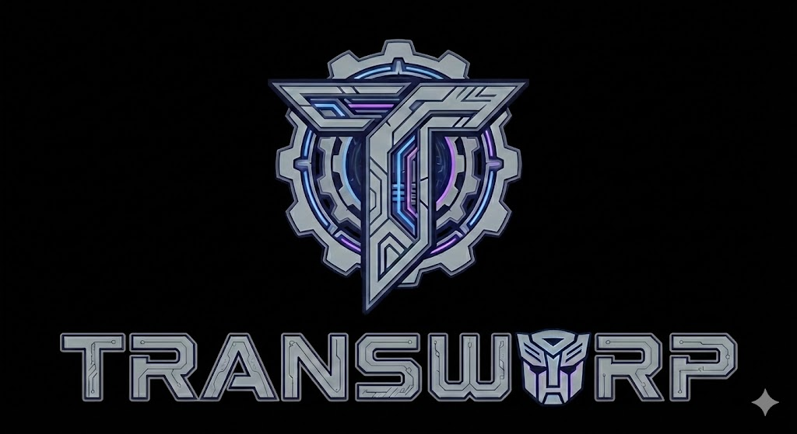

# Transwarp 🚀





**Transwarp** is a high-performance, abstraction layer for Go web servers. It allows you to write your HTTP logic using standard `net/http` handlers and run it on top of the industry's fastest web frameworks (**Fiber**, **Echo**, **Gin**, or **Chi**) without changing a single line of your business code.

Transwarp uses **Go Build Tags** to ensure zero overhead. If you compile for Gin, the Fiber dependencies are not included in your binary, and vice versa.

## 🌟 Key Features

* **Driver Agnostic:** Switch between Fiber, Echo, Gin, and Chi just by changing a build flag.
* **Zero Overhead:** Uses compile-time conditional inclusion. Your binary only contains the driver you select.
* **Standard Interface:** Write standard `http.HandlerFunc`. No more proprietary `c *gin.Context` or `c fiber.Ctx` locking you in.
* **Unified Routing:** Use universal `:param` syntax. Transwarp handles the translation to specific router syntaxes (e.g., `{param}` for Chi) automatically.
* **Middleware Bridging:** Use standard `func(next http.Handler) http.Handler` middlewares. Transwarp adapts them to work correctly with Gin's `Abort()` or Fiber's middleware chain.
* **Mock Driver:** Includes a thread-safe Mock Router for lightning-fast unit testing without opening TCP ports.

## 📦 Installation

```bash
$ go get github.com/profe-ajedrez/transwarp
```


---


## ⚡ Quick Start

### 1. Write your Application

Create a main.go. Note that you code against the transwarp interface, not the specific framework.


```go
package main

import (
    "net/http"
    "github.com/profe-ajedrez/transwarp"
    // Import the package to trigger the build tags mechanism
    _ "github.com/profe-ajedrez/transwarp/internal/server/adapter/chiadapter"   // Optional reference
    _ "github.com/profe-ajedrez/transwarp/internal/server/adapter/echoadapterechoadapter"  // Optional reference
    _ "github.com/profe-ajedrez/transwarp/internal/server/adapter/fiberadapter" // Optional reference
    _ "github.com/profe-ajedrez/transwarp/internal/server/adapter/ginadapter"   // Optional reference
)

func main() {
    // 1. Get the driver instance (selected via build tags)
    server := transwarp.New()

    // 2. Register Routes
    server.GET("/hello/:name", func(w http.ResponseWriter, r *http.Request) {
        // Use Transwarp to extract params regardless of the underlying driver
        name := transwarp.Param(r, "name")
        w.Write([]byte("Hello, " + name))
    })

    // 3. Start
    server.Serve(":8080")
}
```


### 2. Build & Run

You decide which engine powers your app at compile time using -tags.

* To use Fiber:

```bash
$ go build -tags fiber -o app main.go
$ ./app
```

* To use Gin (Most Popular):

```bash
go build -tags gin -o app main.go
./app
```

* To use Echo (v5):

```bash
go build -tags echo -o app main.go
./app
```

* To use Chi (Lightweight):

```bash
go build -tags chi -o app main.go
./app
```


## 📚 API Documentation

### 1. Routing

Transwarp standardizes routing syntax. Always use :param for dynamic segments.

```Go
// Standard Verbs
server.GET("/users", handler)
server.POST("/users", handler)
server.PUT("/users/:id", handler)
server.DELETE("/users/:id", handler)

// Groups
api := server.Group("/api")
v1 := api.Group("/v1")
v1.GET("/status", statusHandler) // -> /api/v1/status
```


### 2. Accessing Parameters

Since http.Request doesn't natively support URL parameters, Transwarp injects them into the context. Use the helper function Param:

```Go
server.GET("/shop/category/:cat/item/:id", func(w http.ResponseWriter, r *http.Request) {
    // Works on Fiber, Gin, Echo, and Chi identically
    category := transwarp.Param(r, "cat")
    itemID   := transwarp.Param(r, "id")
    
    fmt.Fprintf(w, "Category: %s, Item: %s", category, itemID)
})
```


### 3. Middleware

Transwarp uses the standard "Onion" middleware pattern.

Important: If you want to stop the request chain (e.g., Auth failure), simply return without calling next.ServeHTTP. Transwarp ensures this translates correctly to the underlying engine (e.g., calling c.Abort() in Gin).

```Go
// Firewall Middleware
func AdminOnly(next http.Handler) http.Handler {
    return http.HandlerFunc(func(w http.ResponseWriter, r *http.Request) {
        token := r.Header.Get("Authorization")
        
        if token != "secret-admin-token" {
            w.WriteHeader(http.StatusForbidden)
            w.Write([]byte("Access Denied"))
            // We return here. Transwarp ensures the next handler is NOT executed.
            return 
        }
        
        // Continue to the next handler
        next.ServeHTTP(w, r)
    })
}

// Usage
admin := server.Group("/admin")
admin.Use(AdminOnly)
admin.GET("/dashboard", dashboardHandler)
```


### 🛠 Supported Drivers

```
Driver	Build Tag	Description
Fiber	fiber	Uses Fiber v3. Built on fasthttp. Fastest option. Transwarp handles the complex context bridging automatically.
Echo	echo	Uses Echo v5. Robust and performant.
Gin	gin	Uses Gin Gonic. automatically sets ReleaseMode for production builds.
Chi	chi	Uses go-chi/chi v5. Native net/http compatibility.
```


### 🧪 Testing (The Mock Driver)

Transwarp includes a Thread-Safe Mock Router. This allows you to test your routing logic, middlewares, and handlers without spinning up a real TCP server or dealing with network latencies.

The Mock driver supports:

    Route matching (including standard and dynamic routes).

    Middleware execution.

    Path parameter extraction.

    Route collisions.


### Example Test


```go
func TestMyAPI(t *testing.T) {
    // 1. Create the Mock Router
    m := transwarp.NewMockRouter()
    
    // 2. Register your application routes
    m.GET("/api/user/:id", myHandler)
    
    // 3. Simulate a Request
    req := httptest.NewRequest("GET", "/api/user/42", nil)
    rec := httptest.NewRecorder()
    
    // 4. Execute directly (No network involved)
    // The Mock router automatically routes to 'myHandler' and injects "42" as param
    m.ServeHTTP(rec, req) 
    
    // 5. Assert
    if rec.Code != 200 {
        t.Errorf("Expected 200, got %d", rec.Code)
    }
}
```

## ⚠️ Advanced Notes

* Fiber & Context

Fiber is based on fasthttp, which recycles request contexts for performance. Transwarp performs a deep copy of parameters and headers when bridging to net/http to ensure your handlers are safe to use, even if you perform asynchronous operations.

* Gin & Abort

In Gin, simply returning from a middleware doesn't stop the chain; you must call Abort(). The Transwarp Gin Adapter detects if your standard middleware did not call next() and calls Abort() for you automatically.


📄 License

MIT License. See LICENSE for more information.

